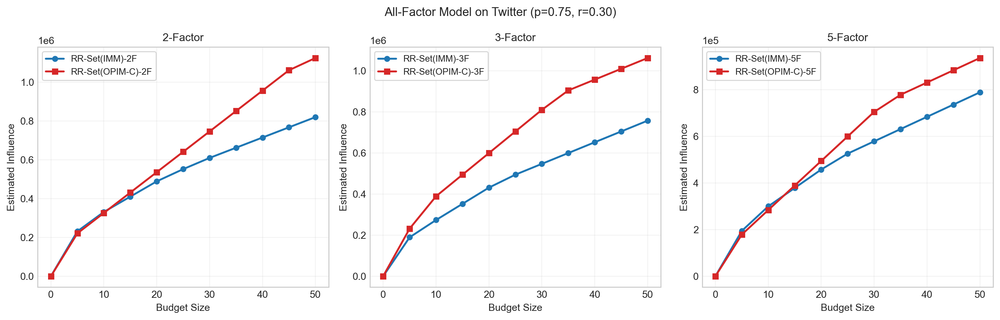

# Submodular and Beyond: Influence Maximization in General Social Networks with Multiple Factors

## All-Factor Model: Experimental Results on Twitter

The following results supplement Section 6.2 of the paper. Due to our paper length, the complete experimental results for the all-factor model are provided here.

### Experimental Setup

| Parameter | Value |
|-----------|-------|
| Dataset | Twitter (~52.58M nodes, 1.963G edges) |
| Model | All-Factor: **30%** of nodes in the graph propagate under the all-factor condition |
| For current node v:<br />Neighbor to factor/factor to v | **p = 1/degree<br />single-factor: p = 0.75 (all factors $`\phi`$ must be active)** |
| Number of RR-sets (fixed): (i.e., run online algorithms) | **10,000** |
| Budget range | k = 0, 5, 10, …, 50 |
| Factor settings | 2-factor, 3-factor, 5-factor |
| Algorithms | Growth RR-Set (IMM), Growth RR-Set (OPIM-C) |

### Influence Comparison



Across all factor settings, RR-Set(OPIM-C) yields slightly higher estimated influence than RR-Set(IMM), and both methods increase monotonically with the budget. Under the 5-factor setting, the estimated influence of both methods is lower than in the 2-factor and 3-factor cases, indicating that as the number of factors grows, the all-factor constraint makes it harder for a node to have all its factors simultaneously activated, thereby suppressing the overall propagation range.

### Running Time (including RR-set sampling, at k = 50)

| Factors | RR-Set(IMM) total (s) | RR-Set(OPIM-C) total (s) |
|---------|----------------------:|-------------------------:|
| 2       | 95.9                  | 46.8                     |
| 3       | 288.2                 | 255.1                    |
| 5       | 128.8                 | 51.3                     |

Both methods take the longest under the 3-factor setting, rather than the 5-factor setting which has the largest graph. This is because running time is jointly determined by graph size and average RR-set size. While a larger graph slows down traversal, the all-factor condition requires all factors to be simultaneously activated, so more factors (e.g., 5-factor, activation probability ≈ 0.75⁵ ≈ 0.24) cause propagation paths to terminate earlier, resulting in smaller RR-sets and faster sampling. The 3-factor setting falls in the worst-case zone — its graph is larger than the 2-factor case, yet its activation probability (≈ 0.75³ ≈ 0.42) is much higher than in the 5-factor case — making it the most expensive overall. RR-Set(OPIM-C) is notably faster than RR-Set(IMM) under 2-factor and 5-factor settings, while the two are comparable under 3-factor.

---

This project is the open source code of paper "Submodular and Beyond: Influence Maximization in General Social Networks with Multiple Factors".

## Requirements

- Python 3.8+
- [NumPy](https://numpy.org/)
- Optional: [PyTorch](https://pytorch.org/) with CUDA — used only when running **MFLT** with the GPU evaluator.
- For `Growth RR-Set (IMM)/` and `Growth RR-Set (OPIM-C)/`: the C++ build/runtime environment is the same as the original IMM and OPIM-C source code.

## Datasets

Three benchmark graphs are included under the `LFG/` directory. Pass the logical name to `--dataset`; each name maps to a file as follows:


| `--dataset`  | File                 |
| ------------ | -------------------- |
| `NetScience` | `LFG/ca-netscience.txt`  |
| `Gnutella`   | `LFG/p2p-Gnutella08.txt` |
| `Wiki`       | `LFG/soc-wiki-Vote.txt`  |


For large-scale and real-world datasets， we use:[Twitter](https://twitter.mpi-sws.org/links-anon.txt.gz), [SAGraph](https://github.com/xiaoqzhwhu/SAGraph/tree/main)

## Quick start

Starting from the project root, here's an example of running a full benchmark on the Gnutella dataset with the Trigger model and 5 factors:

```bash
python main.py \
  --dataset Gnutella \
  --model MFTRIGGER \
  --factors 5 \
  --theta 5000 \
  --realizations 2000 \
  --seed 0 \
  --max-k 50 \
  --step 5 \
  --imm-epsilon 0.5 \
  --imm-ell 1 \
  --algorithms LFG MaxDegree Random GWDM MF-RR MF-IMM \
  --output gn_mftrigger5.csv
```

Among `--algorithms`, `MF-RR` corresponds to RR-Set (Hypergrah), and `MF-IMM` corresponds to the Python implementation of IMM.

Results are written to `**gn_mftrigger5.csv**` (and checkpointed after each budget `k`).

On Windows (PowerShell), the same command on one line:

```powershell
python main.py --dataset Gnutella --model MFTRIGGER --factors 5 --theta 5000 --realizations 2000 --seed 0 --max-k 50 --step 5 --imm-epsilon 0.5 --imm-ell 1 --algorithms LFG MaxDegree Random GWDM MF-RR MF-IMM --output gn_mftrigger5.csv
```


## Repository Structure

```text
Multi-Factor-Model/
├── README.md
├── .gitignore
├── main.py
├── tools.py
├── diffusionModel.py
├── gpu_diffusion.py
├── LFG/
│   ├── algo.py
│   ├── ca-netscience.txt
│   ├── p2p-Gnutella08.txt
│   └── soc-wiki-Vote.txt
├── RR-Set (Hypergrah)/
│   └── mf_rr.py
├── Growth RR-Set (IMM)/
├── Growth RR-Set (OPIM-C)/
└── SAGraph-baseline/
    ├── IC.py
    ├── LT.py
    ├── im.py
    └── nx.py
```


### Directory / File Roles


- main.py
  Main experiment entry. It parses command-line arguments, loads datasets, builds the expanded graph, runs selected algorithms, and writes evaluation results.
- tools.py
  Core utility module. It contains graph readers, expanded-network construction functions for different multi-factor models, and realization-generation helpers.
- diffusionModel.py
  Monte-Carlo diffusion evaluator used to estimate influence spread on sampled realizations.
- gpu_diffusion.py
  Optional GPU-based acceleration for diffusion evaluation, mainly used for large LT-style workloads.
- LFG/
  Code and local benchmark datasets for the Monte-Carlo greedy pipeline.
  - algo.py: implementations of LFG, Greedy, MaxDegree, Random, and GWDM
  - ca-netscience.txt, p2p-Gnutella08.txt, soc-wiki-Vote.txt: bundled benchmark graphs used in experiments,.
  - for MC based greedy algorithm, refer to Kempe's paper.
- RR-Set (Hypergrah)/
  RR-set-based implementations for the multi-factor setting.
  - mf_rr.py: implementations of MF-RR and MF-IMM, including RR-set sampling and max-cover style seed selection(OPIM-C code link at bottom)
- Growth RR-Set (IMM)/
  Contains only the modified parts relative to the original IMM source code, adapted for the multi-factor (all-factor) setting. Original source code: see Acknowledgments.
- Growth RR-Set (OPIM-C)/
  Contains only the modified parts relative to the original OPIM-C source code, adapted for the multi-factor (all-factor) setting. Original source code: see Acknowledgments.
- SAGraph-baseline/
  Baseline code adapted from the SAGraph framework.
  - IC.py, LT.py, im.py, nx.py: supporting baseline implementations and utilities used for comparison, for running in weibo dataset.


### Multi-factor models

The experiment harness supports three model families (selected via `--model`):


| Model        | Diffusion type      | Factor counts |
| ------------ | ------------------- | ------------- |
| `MFIC`       | Independent Cascade | 2, 3, 5       |
| `MFLT`       | Linear Threshold    | 2, 3, 5       |
| `MFTRIGGER`  | The Trigger Model   | 2, 3, 5       |
| `All-Factor` | As described above  | 2, 3, 5       |


For each run, the pipeline:

1. Loads the original graph `G`.
2. Builds the auxiliary multi-factor graph `G'` (`tools.generateGraph_factor_*`).
3. Samples `--realizations` live-edge realizations of `G'`.
4. For each seed budget `k`, each algorithm selects seeds; spread is estimated with `diffusionModel.compute`.

### Baseline

The SAGraph baseline is built upon the original [SAGraph](https://github.com/xiaoqzhwhu/SAGraph/tree/main) framework. The corresponding implementation code used in this project is included in the `SAGraph-baseline/` directory.

## Acknowledgments

The implementation of our **Lazy Forward Greedy (LFG)** algorithm is informed by [CELF](https://github.com/prasanna08/SNInfluenceMaximization).

The publicly available influence maximization baselines mentioned in the experimental results are as follows:

- **[OPIM** (Online Processing Algorithms for Influence Maximization)](https://github.com/tangj90/OPIM)
- **[IMM** (Influence Maximization in Near-Linear Time: A Martingale Approach)](https://sourceforge.net/projects/im-imm/) 
- **[SAGraph** (SAGraph: A Large-Scale Social Graph Dataset with Comprehensive Context for Influencer Selection in Marketing)](https://github.com/xiaoqzhwhu/SAGraph/tree/main)

<!-- ## Citation

If you use this code in academic work, please cite the associated TKDD paper (add bibliographic entry when available).

## License

Specify a license file (e.g. `LICENSE`) before public release if this repository is distributed as open source. -->
